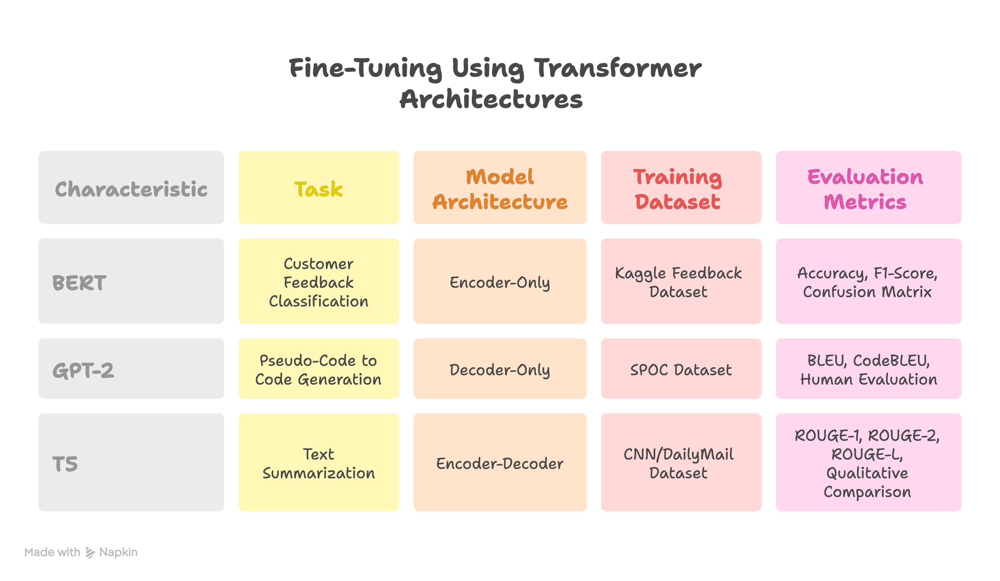

# Fine-Tuning Transformer Architectures for NLP Applications



## Overview

This project explores fine-tuning three different Transformer architectures for various NLP tasks using the Hugging Face Transformers library. Each task demonstrates the unique strengths of different model types:

- **Encoder-Only (BERT)** - Sentiment Classification
- **Decoder-Only (GPT-2)** - Code Generation
- **Encoder-Decoder (T5)** - Text Summarization

## Table of Contents

- [Tasks](#tasks)
  - [Customer Feedback Classification (BERT)](#customer-feedback-classification-bert)
  - [Pseudo-Code to Code Generation (GPT-2)](#pseudo-code-to-code-generation-gpt-2)
  - [Text Summarization (T5)](#text-summarization-t5)
- [Installation](#installation)
- [Key Learnings](#key-learnings)
- [Conclusion](#conclusion)

## Tasks

### Customer Feedback Classification (BERT)

**Objective:** Classify customer feedback into positive, negative, or neutral categories.

#### Why BERT?

BERT is an encoder-only Transformer designed for understanding text. Its bidirectional nature allows it to capture deep contextual meaning, making it ideal for classification tasks.

#### Implementation

- Fine-tuned BERT base model on the Kaggle Customer Feedback Dataset
- Applied data augmentation to address small dataset size and binary labels
- Generated neutral examples through paraphrasing to balance the dataset

#### Evaluation Metrics

- **Accuracy** - Overall performance
- **F1-Score** - Handling class imbalance
- **Confusion Matrix** - Visualizing prediction errors

#### Results

The fine-tuned BERT model achieved strong performance across all three sentiment classes, demonstrating the effectiveness of data augmentation for limited datasets.

---

### Pseudo-Code to Code Generation (GPT-2)

**Objective:** Generate Python code from structured pseudo-code instructions.

#### Why GPT-2?

GPT-2 is a decoder-only model that excels at text generation. Its autoregressive nature makes it suitable for tasks requiring logical structure and token dependencies, like code generation.

#### Implementation

- Fine-tuned GPT-2 on the SPOC dataset (pseudo-code to Python)
- Used Causal Language Modeling (CLM) objective
- Training limited to one epoch due to computational constraints

#### Challenges

- Google Colab runtime crashes due to GPU memory limits
- Computationally demanding training process

#### Evaluation Metrics

- **BLEU Score** - Token overlap with reference code
- **CodeBLEU** - Syntax-aware evaluation
- **Human Evaluation** - Readability and correctness

#### Results

Despite partial training, GPT-2 produced meaningful code snippets for simple inputs, confirming its potential for structured text generation.

---

### Text Summarization (T5)

**Objective:** Generate concise summaries from long text articles.

#### Why T5?

T5 (Text-to-Text Transfer Transformer) reformulates NLP tasks as text-to-text transformations, combining encoder context understanding with decoder fluent generation for effective summarization.

#### Implementation

- Fine-tuned T5-base on the CNN/DailyMail dataset
- Limited to 2,000 training samples and 200 validation samples due to computational constraints
- Preserved dataset diversity while enabling faster experimentation

#### Challenges

- Full dataset would require 36+ hours of training on Colab
- Resource optimization required for practical experimentation

#### Evaluation Metrics

- **ROUGE-1, ROUGE-2, ROUGE-L** - Lexical and structural overlap
- **Qualitative Evaluation** - Readability and content preservation

#### Results

The model generated coherent, context-aware summaries that captured the essence of original texts, even when trained on a subset of the data.

---

## Installation

```bash
# Clone the repository
git clone https://github.com/hasnaatmalik/finetuning.git
cd finetuning

# Install dependencies (recommended: create a virtual environment first)
pip install -r requirements.txt
```

## Key Learnings

- **Data preparation is crucial** - Augmentation strategies help address small and imbalanced datasets
- **Hardware limitations matter** - Large models require substantial computational resources
- **Efficiency over scale** - Well-fine-tuned subsets can yield valuable insights
- **Architecture-task alignment** - Encoders excel at understanding, decoders at generation, and encoder-decoders at both

## Conclusion

This project provides hands-on experience with fine-tuning Transformer models for different NLP applications. BERT excelled in classification tasks, GPT-2 showed promise in code generation, and T5 demonstrated strong summarization capabilities. Despite computational constraints, the results highlight the remarkable adaptability of Transformer architectures across diverse NLP tasks.

---

## Contributing

Contributions are welcome! Please feel free to submit a Pull Request.

## License

This project is open source and available under the [MIT License](LICENSE).

## Contact

**Hasnaat Malik** - [@hasnaatmalik](https://github.com/hasnaatmalik)

Project Link: [https://github.com/hasnaatmalik/finetuning](https://github.com/hasnaatmalik/finetuning)
